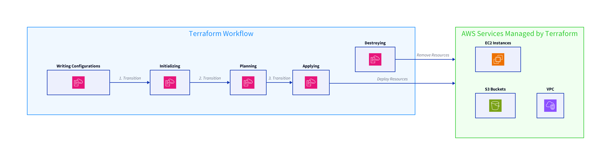
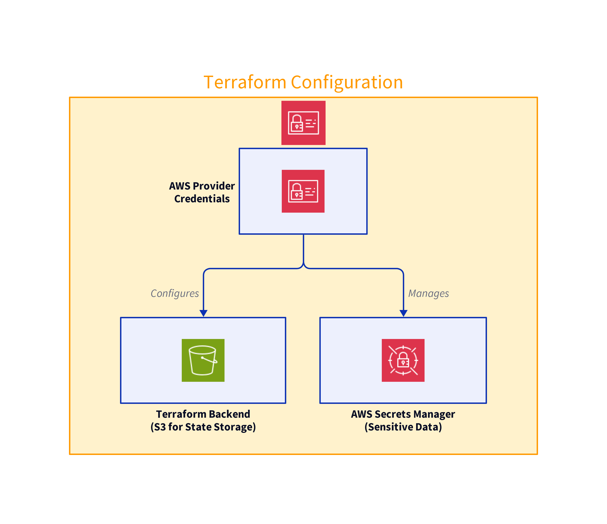
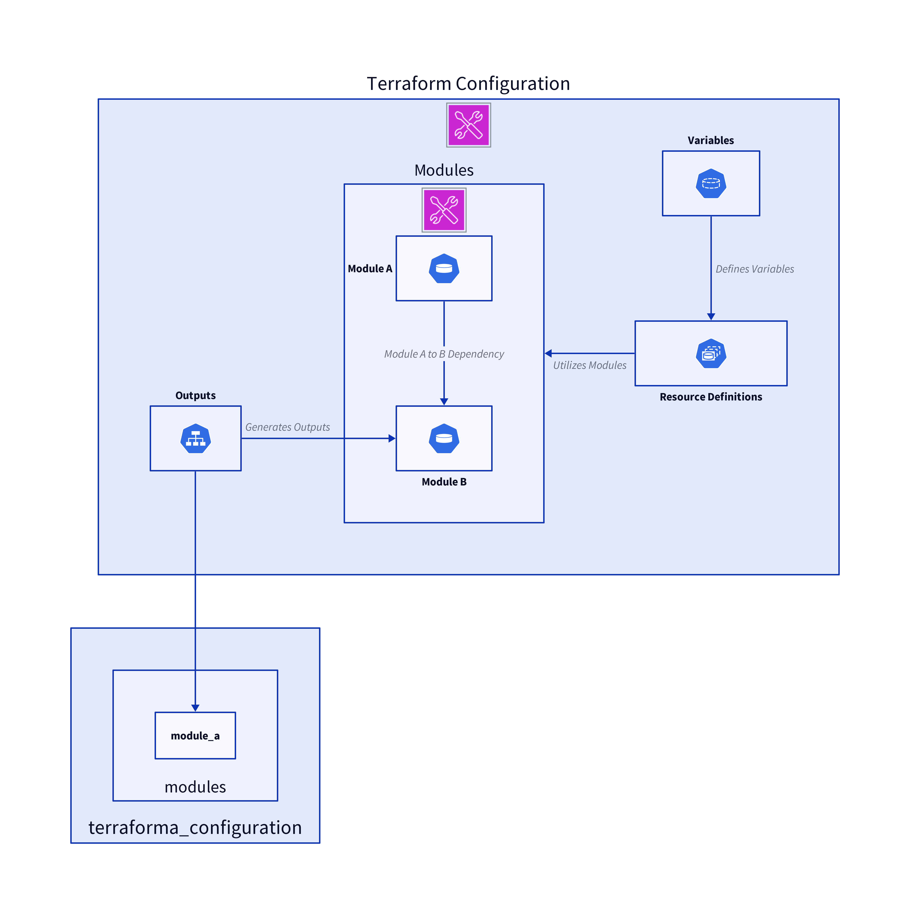
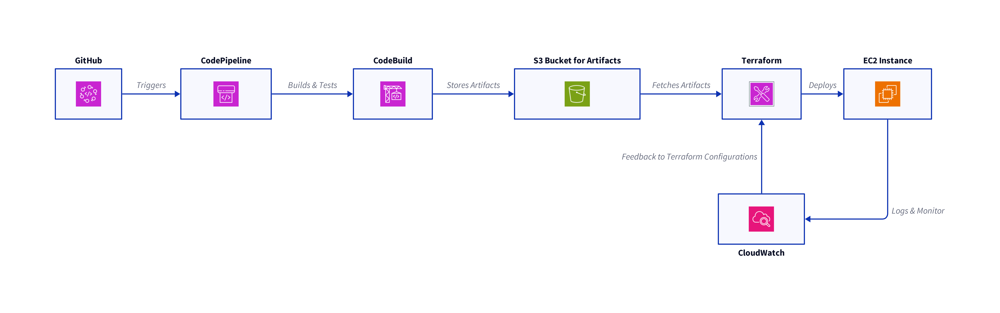

# AWS Terraform automation
Automating AWS Infrastructure Deployments with Terraform and CI/CD Integration

## AWS demo project using Terraform

### Project Outline

1. Setting Up Terraform with AWS
1. Writing Terraform Configurations
1. Automating AWS Infrastructure Deployments with Terraform and CI/CD Integration


